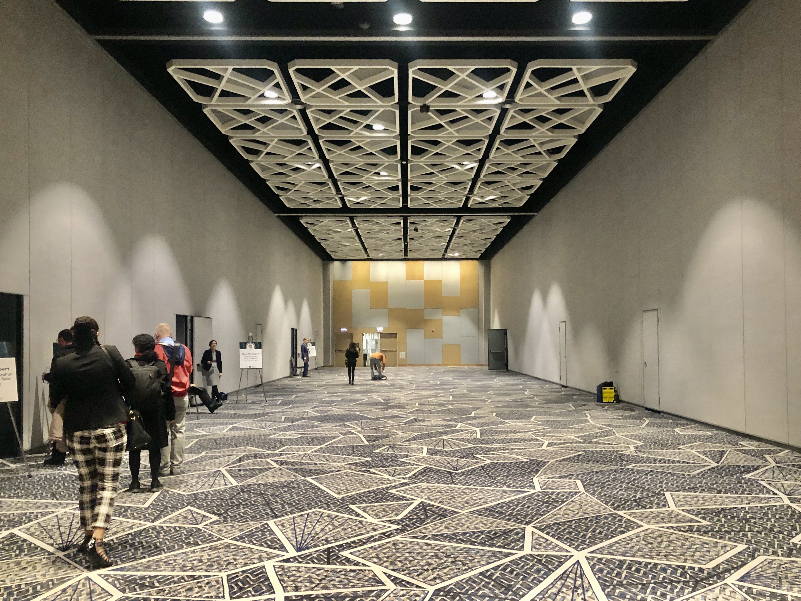
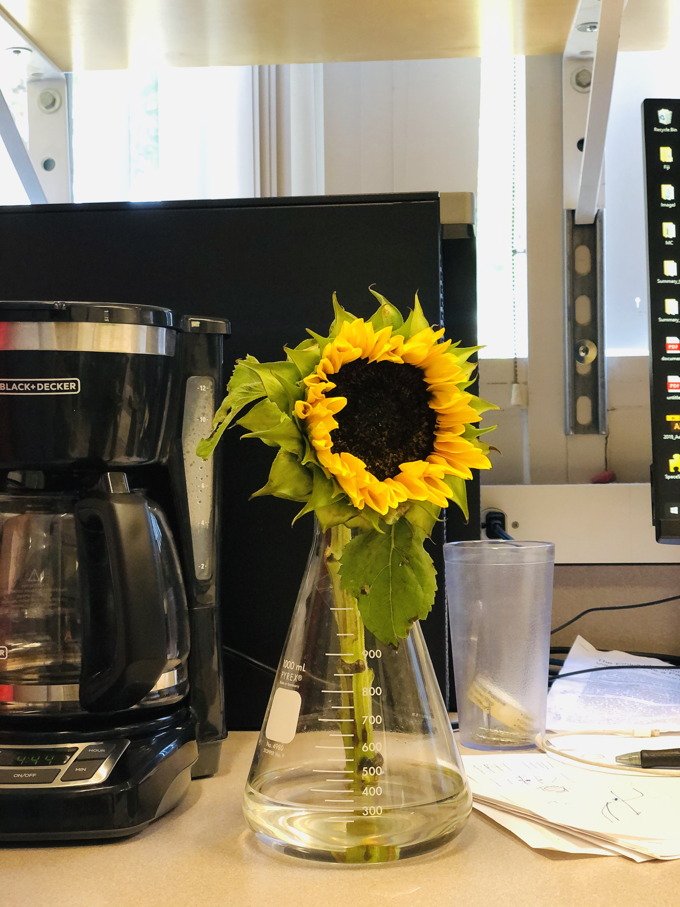

Now that I am old enough to talk about personal preference, I would like to list a few here. I still observe the huge plasticity/variability in my decision makings. Anyway, these are the most enduring ones -- 

## Running
This daily (fairly speaking, weekly) life ritual dates back to my high school sophomore, when my friend encouraged me run one circle around the field track. The subtle good feeling of being able to run longer and longer keeps me hitting the road. This habit just sticks with me for the past 5 years.   

About two years ago, I began using APP to record this reward seeking behavior.The accumulated distance now is over 800km. If no accident happens (I definitely expect so), it will grow quickly.

Hopefully, I will get enough passion for a marathon some day before I turn too old (now I am already old being 20 !).

## Photos
Without enough time and dollars for a DSLR camera, I can only picture the occasionally artistic world with my iPhone. But it is already statisfactory to me --

#### McCorwick Palace, SfN 2019 Venue, Chicago

#### after sunset at La Jolla beach, San Diego

#### sunflower at Dr. Wang's lab, UC San Diego

#### sunflowers at graduate student office, Shanghai Jiao Tong University, Shanghai

## Informative conversations
Gradually I feel talking consumes energy. Therefore, I am practicing being concise and perfer the conversations to be so on a daily basis. So please forgive me being quiet in some occasion, I am just overwhelmed by the complexity in the sentences and have difficulty making a good response. 

Also I would be extremely happy and vocal when having inspiring chats with some (usually senior) people.

## Doing 'Browian motion' in big cities
I have been to a few:
UK: London, Oxford;
US: New York, San Diego, Boston, Philly, Hanover, Chicago...;
Germany: Frankfurt;
PRC: Beijing, Shanghai, Suzhou, Nanjing, Hong Kong, Guangzhou, Mohe(the northernmost Chinese city!)...

## Foods
Esspresso beverage, Oatmeal, Poke bowls, Greek salad ... and more to be explored! 
And struggling to eat healthy.

